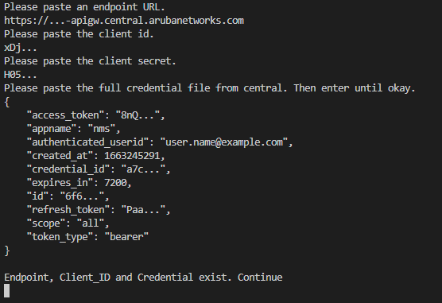

# API Setup

## Get Access Token + Endpoint

### Endpoint


### Credentials


## Automatic Install

Start the Application with `start-web.bat`

You will be promted to enter the credentials



## Manual Install

You can also manually create the files.

#### endpoint.json

``` json
{
    "name": "Central",
    "base_url": "https://...-apigw.central.arubanetworks.com"
}
```

#### credential.json

``` json
{
    "access_token": "8nQ...",
    "appname": "nms",
    "authenticated_userid": "user.name@example.com",
    "created_at": 1663245291,
    "credential_id": "a7c...",
    "expires_in": 7200,
    "id": "6f6...",
    "refresh_token": "Paa...",
    "scope": "all",
    "token_type": "bearer"
}

```

#### client_id.json

``` json
{
    "client_id": "xDj...",
    "client_secret": "H05..."
}
```
