# Installation

For the install three files are needed.
[Python](https://www.python.org/downloads/), [Git](https://git-scm.com/download/win) and the [Tool](https://github.com/sukram230799/central-device-lifecycle-tool/archive/refs/heads/main.zip) itself.

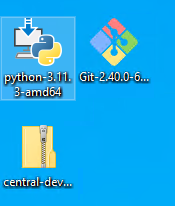

## Python

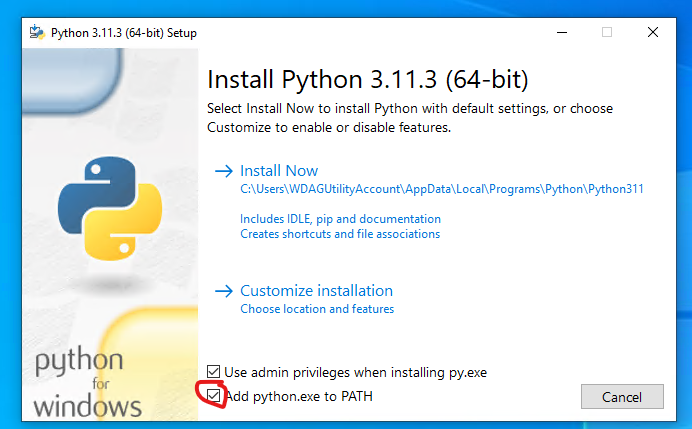

Make sure that Python will be installed in the PATH.
Then click `Install Now`.

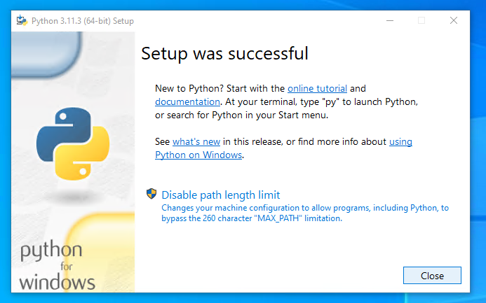

Once Python is installed, you can close the installer.

## Git

The Git Install is a bit more tedious - but all the defaults can be left as they are.

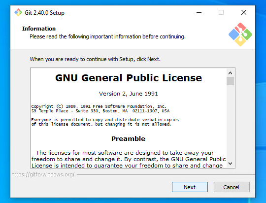

Click on `Next` to accept the license

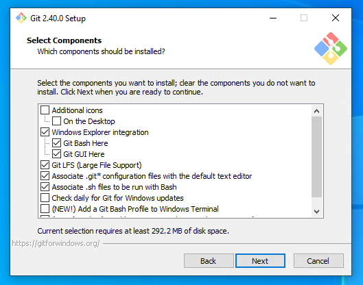

Click `Next` to accept all the default settings until you see the following screen.

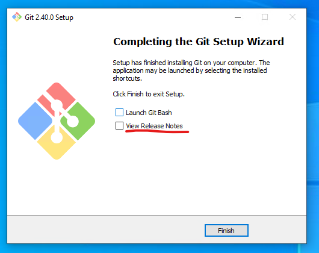

Click `Finish` to close the installer.

## Tool 

Now we can extract the ZIP Folder.

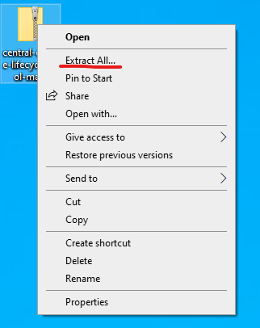

Right-click on the folder and then click (left) on `Extract All...`

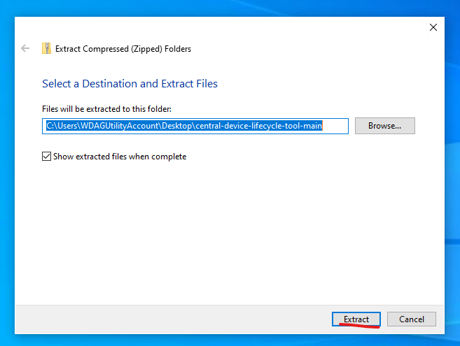

Now click `Extract`

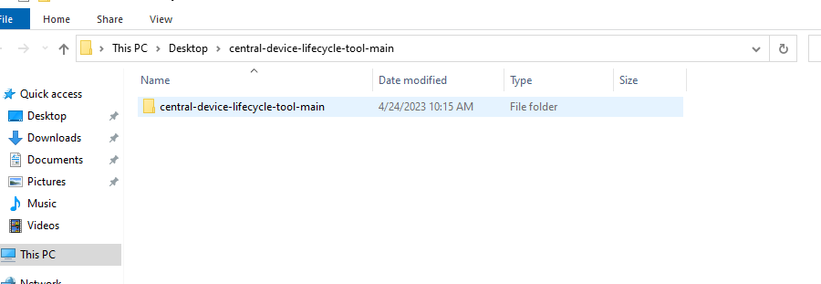

You can now open the extracted Folder.

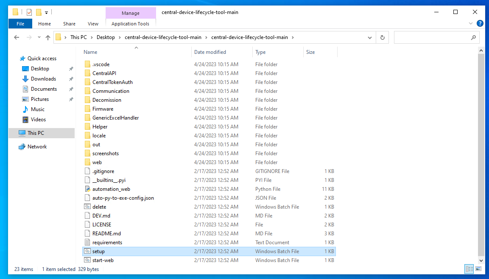

Please start `setup.bat` to install the necessary environment.

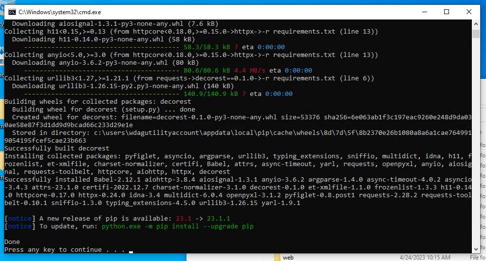

You shouldn't see any errors in the console. If you do, the installation didn't work. Please check if you have Network connectivity.

Once the installation is complete, you can close the window.
