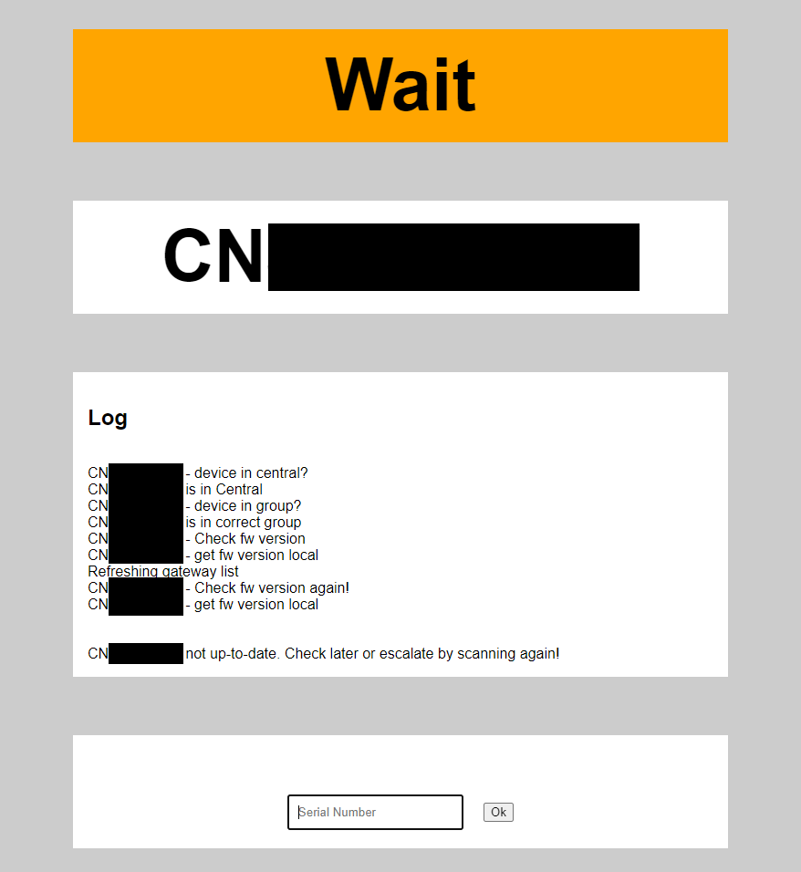
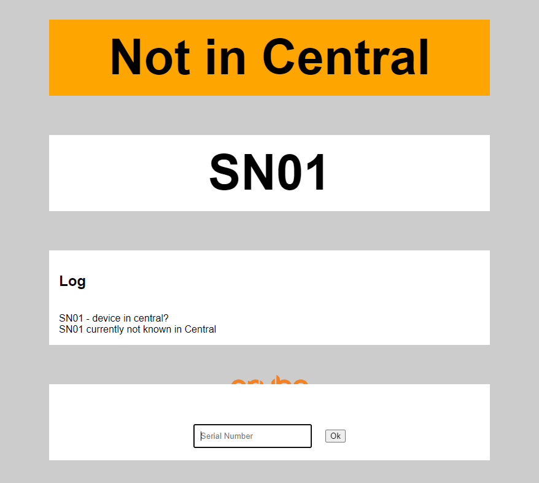
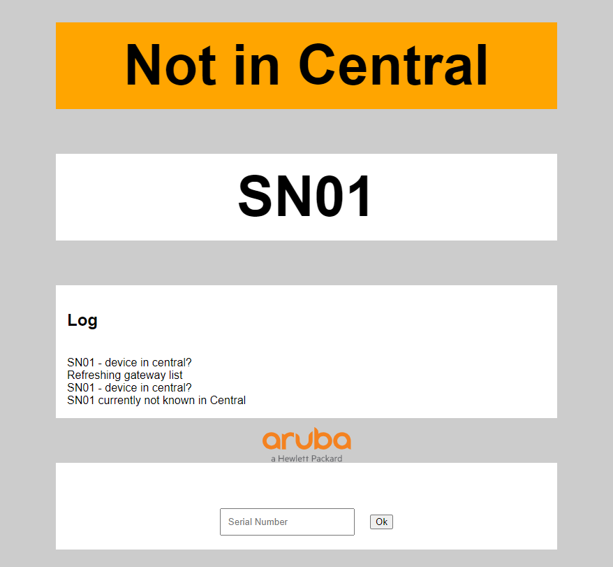
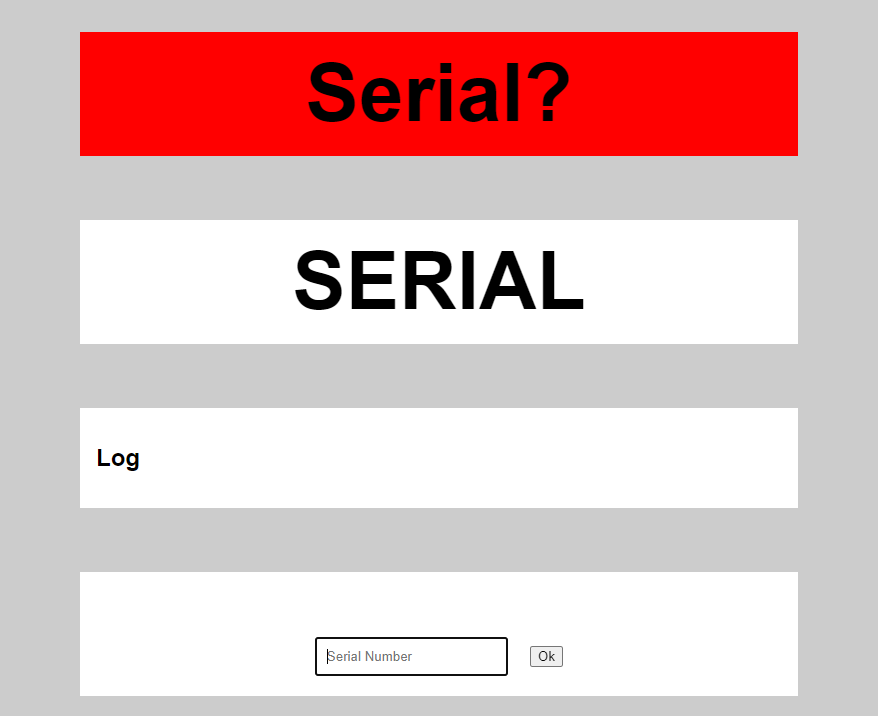
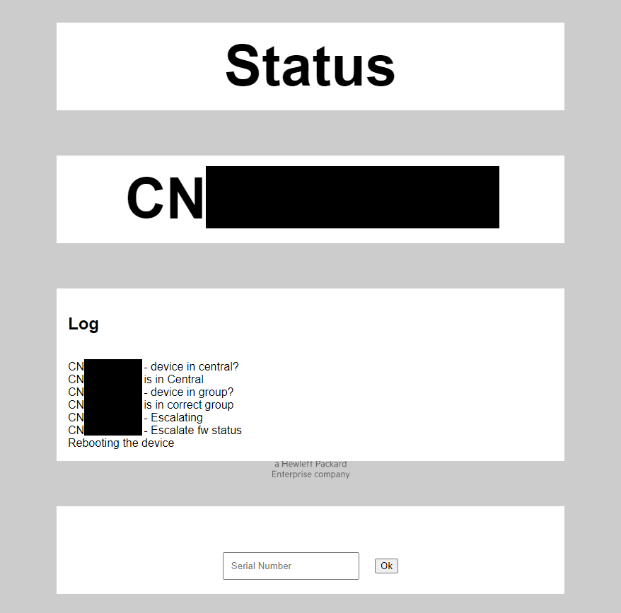

# Central Device Lifecycle Tool

Tool to handle tasks relating to upgrading firmware and de-/comissioning of devices.

## Requirements + Environment Setup

Check for python using `python --version` or `python3 --version`. Python3.x is required and must be installed in the path.

Git is also needed for a custom library to handle the API calls to Central. Screenshots for the entire setup can be found [here](./INSTALL.md).

### Easy Setup + Start

Use `setup.bat` to setup environment (Python in path required). Use `start-web.bat` to start the app and configure credentials. Screenshots for the setup can be found [here](./INSTALL.md#tool).

### Virtual Environment

Create virtualenv to install project dependencies only for this project

``` sh
python -m virtualenv venv
```

### Before each start

Activate the created environment before each usage

#### Windows + Powershell

``` powershell
& .\venv\Scripts\Activate.ps
```

#### Windows + CMD

``` cmd
call venv/Scripts/activate
```

#### Linux

``` sh
source ./venv/bin/activate
```

## Install

``` sh
python -m pip install -r requirements.txt
```

## API Setup

To setup the tool you need API-Credentials from Central. You can view the process [here](./API-Key.md).

## Usage

### Simple

`python automation_web.py`

### Web

`python automation_web.py --web`

## Screenshots (Web)

### Wait for update to complete



### Device (currently) not known in Central



### Device not known. Second scan, refresh gateway



### Invalid Serial Number



### Drilldown for device upgrade state


